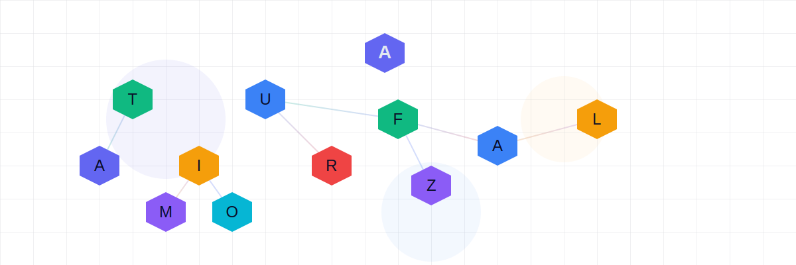

  

    
    

      
    

  

  

  

---

1. **2+ years of professional experience** working with **Ruby on Rails**, delivering projects for clients worldwide.  

2. **NASA Space Apps Challenge 2025** — Participated as part of **Cosmic Pioneers PK Team**.    
   -  [Code and Resources](https://www.spaceappschallenge.org/2025/find-a-team/cosmic-pioneers-pk/?tab=project)

3. **Meta Hacker Cup 2025** — Competed in the global coding competition.  
   -  [View Certificate](https://www.facebook.com/codingcompetitions/hacker-cup/2025/certificate/872128397815225)

4. **United Nations World Innovation Day Hackathon 2023** — Participated as part of **The Mindful Innovators Team**.  
   -  Our Project: **SerenitySphere** — an *Oracle APEX-powered AI mental health support platform*  
   -  [Code](https://github.com/Shami1502/Mental-Health/tree/main)  
   -  [Live Demo](https://www.youtube.com/watch?v=LItqe_-UtYI)

---

<!-- 

  

  

 -->

  
  
  
  &nbsp;&nbsp;	

